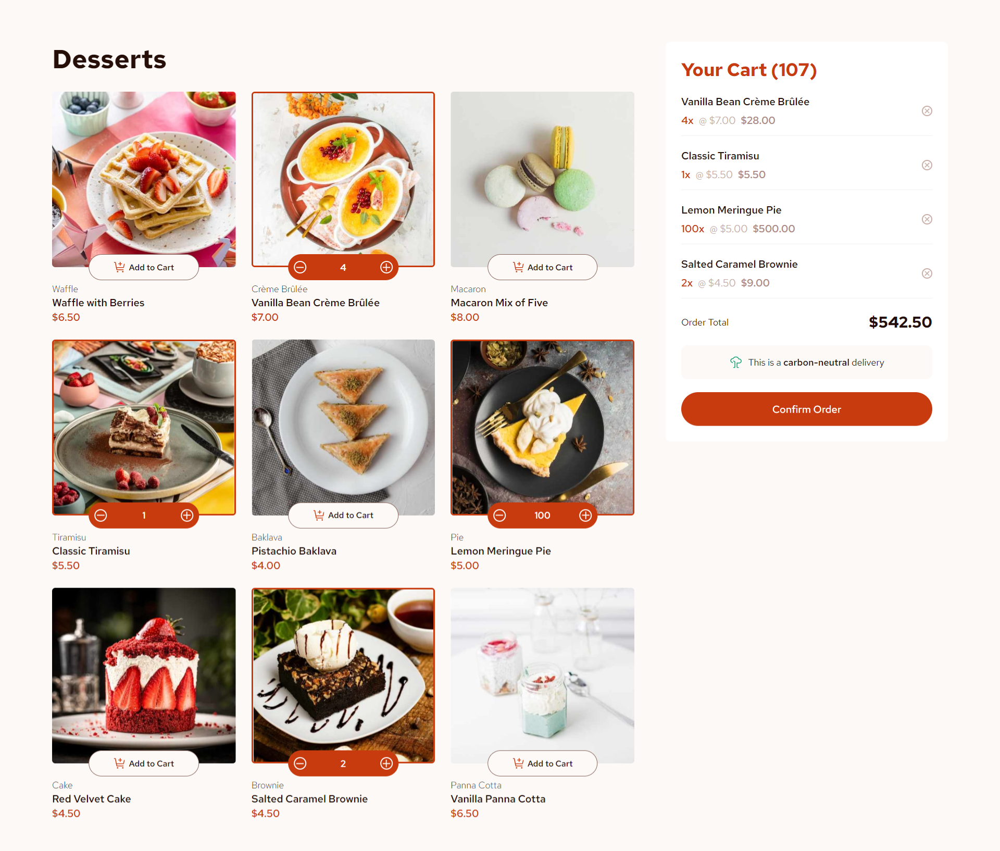

# Frontend Mentor - Product list with cart solution

This is a solution to the [Product list with cart challenge on Frontend Mentor](https://www.frontendmentor.io/challenges/product-list-with-cart-5MmqLVAp_d).

## Table of contents

- [Overview](#overview)
  - [The challenge](#the-challenge)
  - [Screenshot](#screenshot)
  - [Links](#links)
- [My process](#my-process)
  - [Built with](#built-with)
  - [What I learned](#what-i-learned)
  - [Continued development](#continued-development)
  - [Useful resources](#useful-resources)
- [Author](#author)

## Overview

### The challenge

Users should be able to:

- Add items to the cart and remove them
- Increase/decrease the number of items in the cart
- See an order confirmation modal when they click "Confirm Order"
- Reset their selections when they click "Start New Order"
- View the optimal layout for the interface depending on their device's screen size
- See hover and focus states for all interactive elements on the page

### Screenshot



### Links

- Solution URL: [Add solution URL here](https://your-solution-url.com)
- Live Site URL: [Add live site URL here](https://your-live-site-url.com)

## My process

### Built with

- Semantic HTML5 markup
- CSS custom properties
- Flexbox
- CSS Grid
- [Node.js](https://nodejs.org)
- [React](https://reactjs.org/) - JS library

### What I learned

#### Picture tags

I learned about `<picture>` tags and how they are used to change image sources based on screen sizes.

```html
<picture>
  <source media="(max-width:1025px)" srcset={tabletImage} />
  <source media="(max-width:768px)" srcset={mobileImage} />
  
</picture>
```

#### Flexbox, Grid, and size properties (max-content)

I learned about a lot about styling with Flexbox and Grid. I also learned how to set layout with different values, such as `fr` or `max-content`

```css
.cart-item {
    display: grid;
    grid-template-columns: max-content 1fr;
    row-gap: 0.5rem;
    font-size: 1rem;
    padding-bottom: 0.8rem;
    border-bottom: 0.5px solid #f2f2f2;
}
```

#### Lifting state up

Lifting state is when you move a state variable to a common ancestor of another component that needs to use this state. Then, you can pass the state to both components via props.

In the following example, `quantities` and `setQuantities` are our lifted states. Then, we pass them to the `FoodGrid` and `Cart` components with props.

```js
function App() {
  const [quantities, setQuantities] = useState(Array(foodData.length).fill(0));

  return (
    <FoodGrid quantities={quantities} setQuantities={setQuantities} />
    <Cart quantities={quantities} setQuantities={setQuantities} />
  );
}
```

### Continued development

Styling is one thing I'm not completely satisfied about, since I always feel like there are changes to be made. Even slight pixel differences feel weird. Also, responsiveness in small mobile screens and large desktop screens was hard to implement, but I think I'm happy with that for now.

I don't think my Javascript code is terrible, even though I don't really feel confident with it. I do think that there are better practices to use in implement different structures in my code. For example, I think there should be a more organized way of dealing with my state variables.

### Useful resources

- [Flexbox Guide](https://css-tricks.com/snippets/css/a-guide-to-flexbox/) - This is a wonderful resource from CSS-Tricks about Flexbox.
- [Grid Guide](https://css-tricks.com/snippets/css/complete-guide-grid/) - This is an another wonderful resource from CSS-Tricks about Grid.
- [Sharing state between components](https://react.dev/learn/sharing-state-between-components) - An article from the official React documentation about "Lifting state up"
- [`max-content`](https://developer.mozilla.org/en-US/docs/Web/CSS/max-content) - A page from the MDN documentation that made me understand `max-content` (I know it's literally the official documentation, but whatever)

## Author

- Frontend Mentor - [@tigerBoss101](https://www.frontendmentor.io/profile/tigerBoss101)
- Github - [tigerBoss101](https://github.com/tigerBoss101/)
